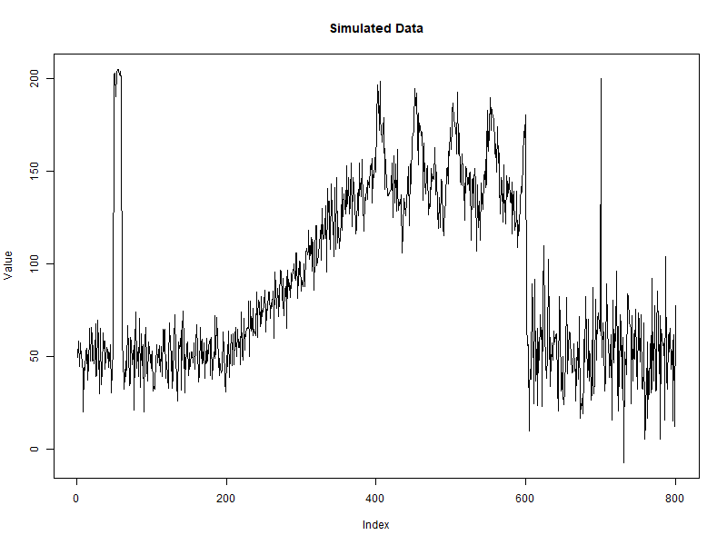
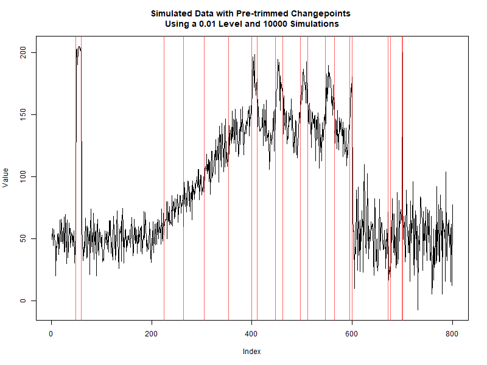
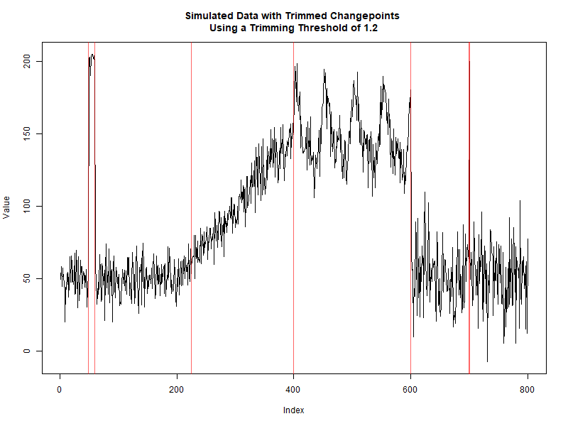

# Automated Selection of Changepoints using Empirical P-values and Trimming (ASCEPT)

When presented with a time series, an investigator may find sudden changes in how the observations are distributed. These shifts occur at at what are called "changepoints" and often need to be identified before further analysis. One of the most popular changepoint detection algorithms is Pruned Exact Linear Time (PELT), which performs an optimization over possible sets of changepoints fit to the data, penalizing for including more and more changepoints. Changepoints for a Range of Penalties (CROPS) helps by efficiently running PELT for many different penalty values. However, an investigator may need to look through many different results from running CROPS on PELT to find a "best fit" for their data.

Automated Selection of Changepoints using Empirical P-values and Trimming (ASCEPT) makes this process easier by selecting changepoints from PELT based on their statistical significance in improving a model fit to the data. It then allows the user to trim the set of changepoints of false positives that may arise due to linear trends or seasonality in the data.


## Getting Started

These instructions will walk the user through installing and using ASCEPT in ``R``. ASCEPT is implemented in the ``changepointSelect`` package, available at <https://github.com/matthewquinn1/changepointSelect>.

We will not be discussing technical details behind the methods here. For those details, please refer to the paper for ASCEPT **cite paper**.

### Installing

To install a package from GitHub, you should make sure that you have the ``devtools`` package installed. The following will install it if it is not already.

```r
if(!require("devtools")){
    install.packages("devtools")
}
library("devtools")
```

The ``changepointSelect`` package, which implements ASCEPT, can then be installed and loaded using the following.

```r
install_github("matthewquinn1/changepointSelect")
library("changepointSelect")
```

## Example

Having installed and loaded the ``changepointSelect`` package, we can now run ASCEPT on series of observations. Consider the [simulated time series](data/simSeries.RData) available within the package.



We notice major mean-shifts in the observations at indices 49, 60, 600, 699, and 700 (note that a changepoint is defined to be the point immediately before the shift occurs). Additionally, there is a linear trend from indices 200 to 400 and seasonality from 400 to 600. Let us run the first stage of ASCEPT, which selects changepoints from running CROPS on PELT based on a Monte Carlo experiment and a significance level. In this case, we use 10,000 simulations, or trials, and a significance level of 0.01. We run this in parallel using 2 cors. Note that the simulated data is loaded in as ``simSeries`` when loading the package.

```r
simChangepoints <- getChangepoints(series=simSeries, alpha=0.01, numTrials=10000, serial=F, numCores = 2)
```

We find that we select the following changepoints initially.


Clearly, we have many proposed changepoints that arise due to the linear trend and the seasonal pattern. To account for these false positives, we should trim this initial set of changepoints. We do so using the ``trimChangepoints()`` function. We pass it the simulated data, the initial set of changepoints, and thresholds for when to trim a changepoint. In order to trim changepoints for both linear trends and seasonality, ``thresholdLinear`` and ``thresholdSeaonal`` must both be larger than 1. If  ``thresholdLinear > 1`` and  ``thresholdSeasonal <= 1``, then the changepoints will only be trimmed for linear trends. If  ``thresholdLinear <= 1`` and  ``thresholdSeasonal > 1``, then the changepoints will only be trimmed for seasonality. However, it is generally recommended to trim for both linear trends and seasonality. Thresholds between 1 and 1.5 seem to be reasonable, but the investigator is encouraged to try multiple values since the utility of a given value will depend on how extreme mean-shifts are relative to the surrounding observations. Here, we use thresholds of 1.2 for both linear trends and seasonality.

```r
simChangepointsTrimmed <- trimChangepoints(series=simSeries, changepoints=simChangepoints, thresholdLinear=1.2, thresholdSeasonal=1.2)
```

We find that we are left with the following changepoints.



In this particular case, the trimming works very well. We are left with the correct changepoints reflecting mean-shifts, and have effectively segmented off the linear trend and seasonal pattern. Of course, the investigator should again bear in mind that results will vary depending on the context, again emphasizing the importance of trying multiple threshold values.


## Authors

* **Matthew Quinn** -  <mjq522@g.harvard.edu>


## License

This project is licensed under the MIT License - see the [LICENSE.md](LICENSE.md) file for details


